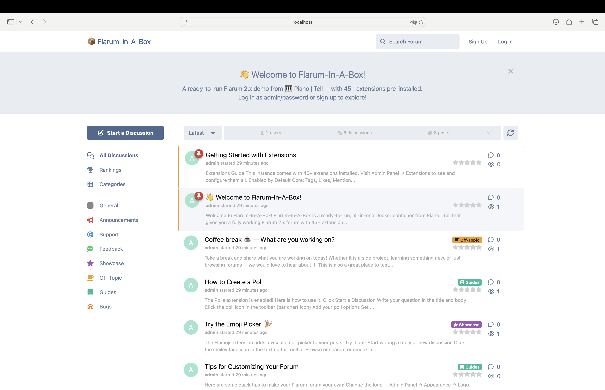
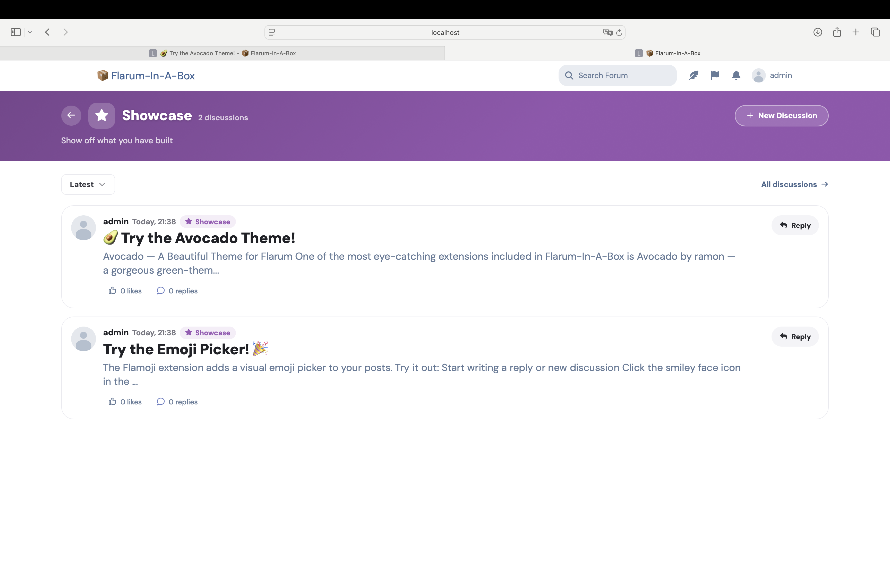

# 📦 Flarum-In-A-Box

All-in-one Docker container with **Flarum 2.x**, ~50 extensions, MariaDB, and Nginx.
One command to launch a fully working forum — from [🎹 Piano | Tell](https://pianotell.com).

> ⚠️ **Demo/playground image** — fantastic for testing and development, but not for production. Data is ephemeral for the lifetime of the container.





## Quick Start

### Option A: Docker Desktop (no terminal needed)

1. Install [Docker Desktop](https://www.docker.com/products/docker-desktop/)
2. Search for `pianotell/flarum-in-a-box`
3. Click **Run** — in Optional Settings be sure to set the host port to `8080`
4. Open [http://localhost:8080](http://localhost:8080)

### Option B: Command Line (one command)

```bash
docker run -d -p 8080:80 --name flarum-in-a-box pianotell/flarum-in-a-box
```

Then open [http://localhost:8080](http://localhost:8080).

### Updating to the Latest Version

Docker caches images locally, so to get the latest release you need
to explicitly pull, remove the old container, and start a fresh one:

```bash
docker pull pianotell/flarum-in-a-box
docker rm -f flarum-in-a-box
docker run -d -p 8080:80 --name flarum-in-a-box pianotell/flarum-in-a-box
```

## Default Accounts

| Account | Username | Password |
|---------|----------|----------|
| Admin   | `admin`  | `password` |
| User    | `user`   | `password` |

## Tips & Tricks

Run Flarum CLI commands directly from the host:

```bash
docker exec flarum-in-a-box php flarum info
```

Get a shell inside the container (to run Composer, edit files, etc.):

```bash
docker exec -it flarum-in-a-box /bin/sh
```

Copy files to and from the container:

```bash
# Host → container
docker cp my-logo.png flarum-in-a-box:/var/www/html/public/assets/

# Container → host
docker cp flarum-in-a-box:/var/www/html/config.php ./config.php
```

## What's Included

### Flarum Core (bundled)

Tags, Likes, Mentions, Subscriptions, Lock, Sticky, Emoji, Flags, Suspend,
Approval, BBCode, Markdown, Statistics, Nicknames.

### ~50 Additional Extensions (enabled by default)

- **Flamoji** — Visual emoji picker
- **AutoVerify** — Auto-confirms email on signup (no mail server needed)
- **FoF Best Answer** — Q&A-style best answers
- **FoF Byobu** — Private discussions
- **FoF Drafts** — Save post drafts
- **FoF Formatting** — Autoimage, Autovideo, MediaEmbed
- **FoF Polls** — Polls in discussions
- **FoF Upload** — File/image attachments
- **FoF User Bio** — Profile bio field
- **FoF User Directory** — Browsable user list
- **FoF Reactions** — Post reactions (beyond likes)
- **FoF Synopsis** — Discussion excerpts in list
- **FoF Impersonate** — Admin can log in as any user
- **FoF Split / Merge** — Split and merge discussions
- **FoF BBCode Details** — Expandable sections in posts
- **FoF Discussion Views** — View counters
- **FoF Rich Text** — WYSIWYG-style editor
- **FoF Gamification** — Voting and rankings
- **FoF Categories** — Category-based navigation
- **FoF Ignore Users** — Ignore other users
- **FoF Linguist** — Customize translations
- **Forumaker Profile Cover** — Cover images on profiles (with GIF/WebP support)
- **Forumaker MagicSlider** — Image slider in posts
- **Forumaker MagicBB** — Extended BBCode toolkit
- **Profile Messages** — Public messages on user profiles (XenForo-style)
- **Mobile Tab** — Bottom navigation on mobile
- **Move Posts** — Move posts between discussions
- **BBCode FA** — Font Awesome icons in posts
- **Stickiest** — Three-tier sticky system
- **Diff** — Post edit history
- **Topic Rating** — Rate discussions
- **Post Search** — Search within posts
- **Forum Widgets** — Customizable widgets
- **Markdown Tables** — Tables in posts
- **Inline Audio** — Audio player in posts

### Installed but Not Enabled

- **Avocado** — A modern, polished theme with hero banner, tag styling, and rich customization (try it!)
- **Colored** — Colored usernames by group
- **Modern Footer** — Responsive forum footer
- **Font Sizer** — Adjustable font sizes
- **Forumaker MagicRead** — Reading progress / scroll tracking
- **Forumaker Yandex OAuth** — Yandex ID login (requires FoF OAuth + setup)
- **Forumaker Yandex SmartCaptcha** — Yandex CAPTCHA for signup
- **FoF OAuth** — Social login framework (Google, Discord, GitHub, etc.)
- **WelcomeBox** — Customizable welcome banner
- **FoF Terms** — Terms of service acceptance
- **FoF Share Social** — Social media sharing
- **FoF Pages** — Custom static pages
- **FoF Discussion Thumbnail** — Thumbnails on discussion list
- **FoF Anti Spam** — Spam prevention

Enable any of these from the Admin Panel → Extensions.

## Customization


If you map to a non-default port, set `FLARUM_FORUM_URL` to match:

```bash
docker run -d -p 9090:80 -e FLARUM_FORUM_URL=http://localhost:9090 \
    --name flarum-in-a-box pianotell/flarum-in-a-box
```

## Links

- [Source code on GitHub](https://github.com/PrimateCoder/flarum-in-a-box)
- [Docker Hub](https://hub.docker.com/r/pianotell/flarum-in-a-box)
- [Changelog](https://github.com/PrimateCoder/flarum-in-a-box/blob/main/CHANGELOG.md)
- [Discuss on Flarum Community](https://discuss.flarum.org/d/39191-flarum-in-a-box-try-flarum-2x-in-one-command-with-docker)
- [Report an issue](https://github.com/PrimateCoder/flarum-in-a-box/issues)

## License

MIT
