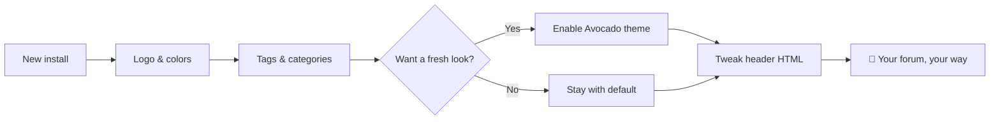

Here are some quick tips to make your Flarum forum your own:

1. **Change the logo** — Admin Panel → Appearance → Logo
2. **Pick a theme color** — Admin Panel → Appearance → Colors
3. **Set a custom header** — Add HTML in Admin Panel → Appearance → Custom Header
4. **Try the Avocado theme** — Enable it from Admin Panel → Extensions for a fresh look
5. **Configure tags** — Organize your discussions with custom tags and colors

Here's the recommended order, rendered with the bundled [**Mermaid**](https://mermaid.ai/open-source/) extension (write a `mermaid` fenced code block in any post):

Flarum is designed to be simple yet powerful. Explore the admin panel to discover all the options!
