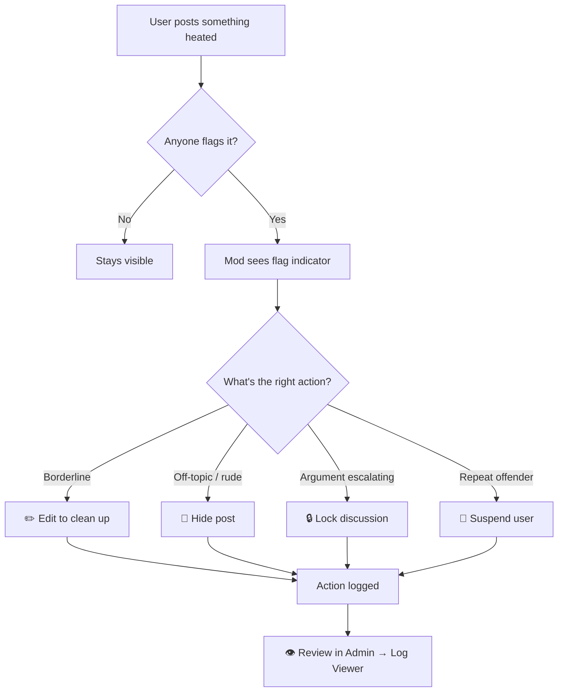

## 🛠️ Moderation Playground

This discussion is intentionally heated — it exists so you can practice **moderator actions** on real-looking content.

The replies below are seed data. Users `user1` through `user5` are arguing about moderation policy and taking shots at each other. None of them are real people; nothing here is anyone's actual opinion.

### What to try

Log in as **moderator** (password: `password`) and try out:

- 🚫 **Hide a post** — click the post menu → Hide (it stays in the database, can be restored)
- ✏️ **Edit a post** — clean up an insult or remove a slur without deleting the whole reply
- 🔒 **Lock the discussion** — click the discussion menu → Lock (no new replies allowed)
- 📌 **Sticky the discussion** — pin it to the top of the list
- 🏷️ **Re-tag** — move it to a different category (e.g. from Off-Topic to Bugs)
- 🚷 **Suspend a user** — click a user's avatar → Suspend; they can't post for the duration
- 👁️ **View flagged posts** — once someone flags something, the moderator sees a flag indicator
- 🗑️ **Delete a post or the whole discussion** — permanent (but you have a fresh container to redo it)

### Notes

- The **admin** account has all moderator permissions plus the Admin Panel. Use the **moderator** account to feel what a non-admin mod sees.

### The moderation flow

Here's roughly what happens from a heated post to a resolution (rendered with the bundled [**Mermaid**](https://mermaid.ai/open-source/) extension — write a `mermaid` fenced block in any post to make your own):

Now scroll down — the gloves are off. 👇
